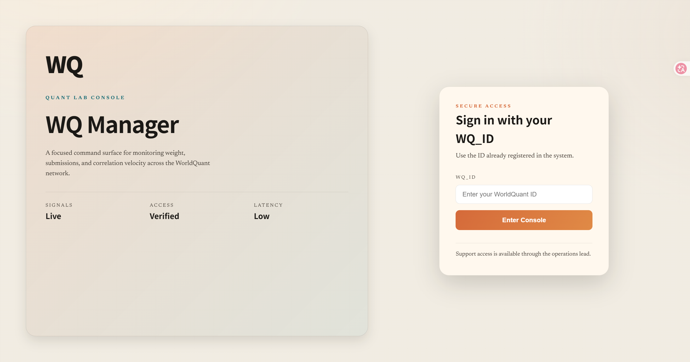
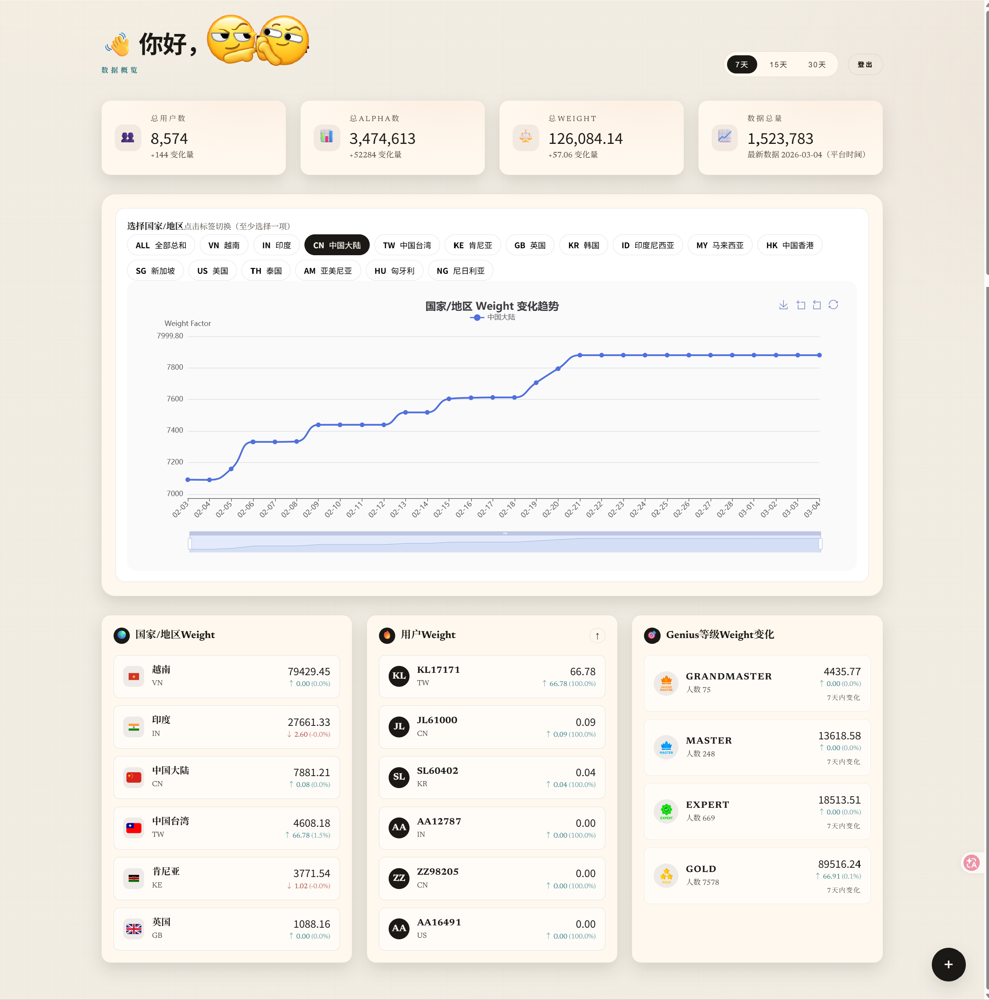
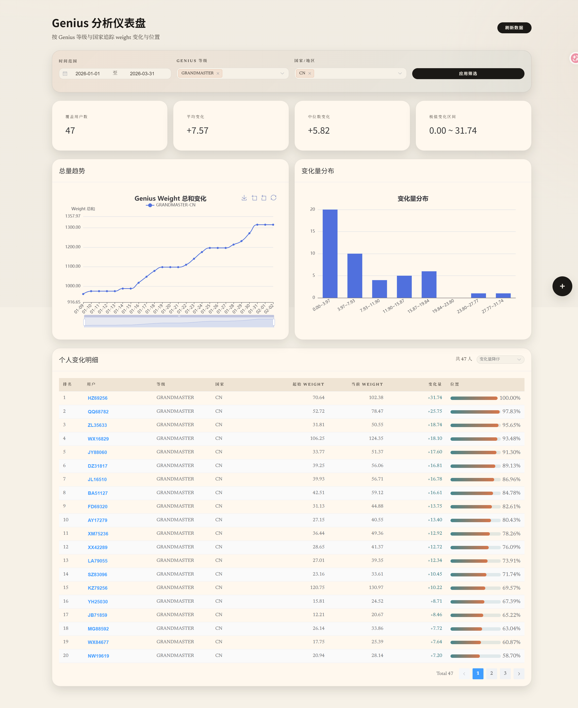
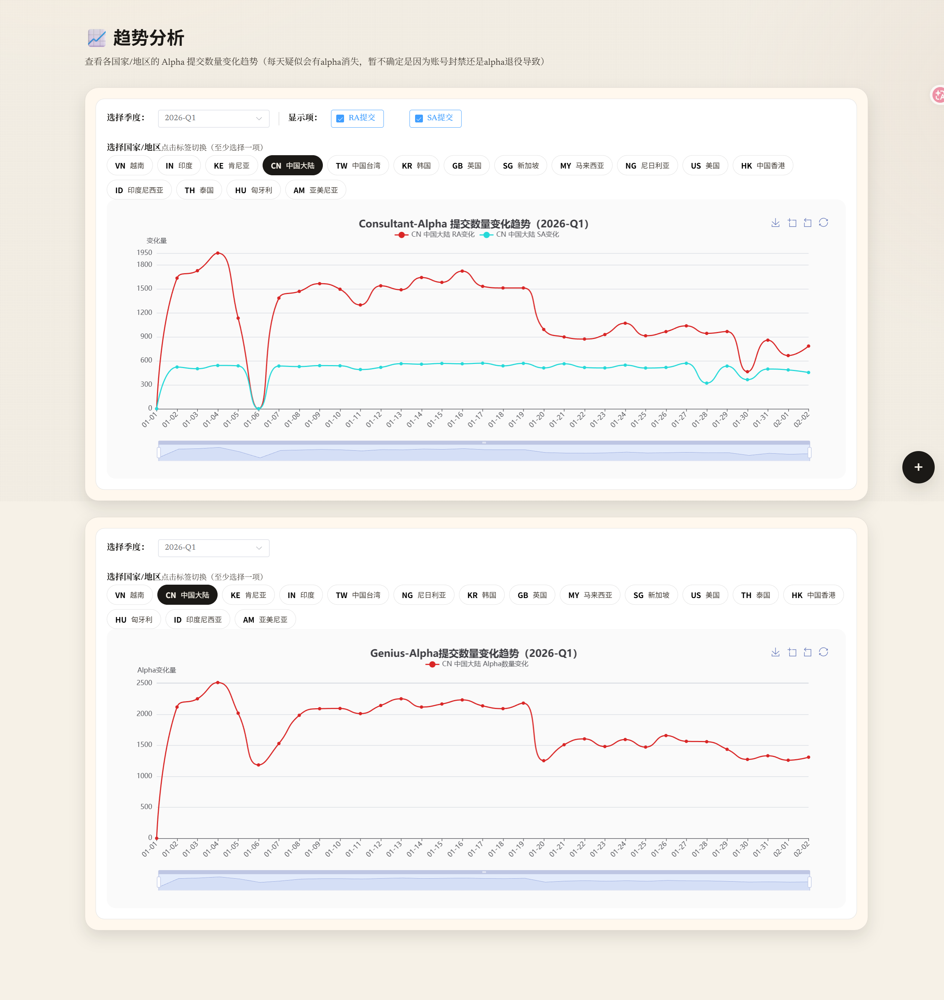
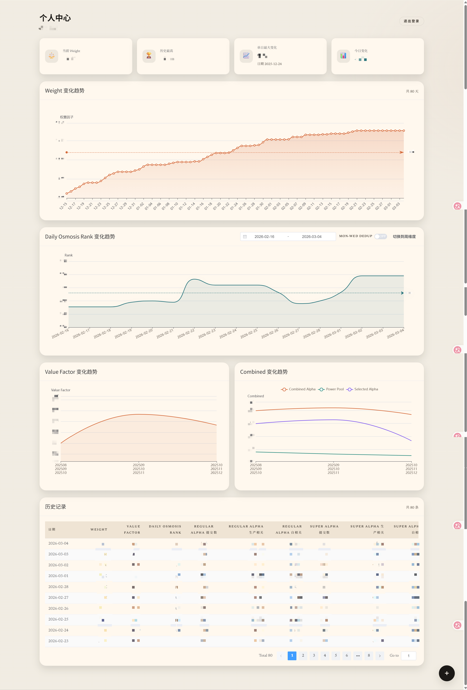
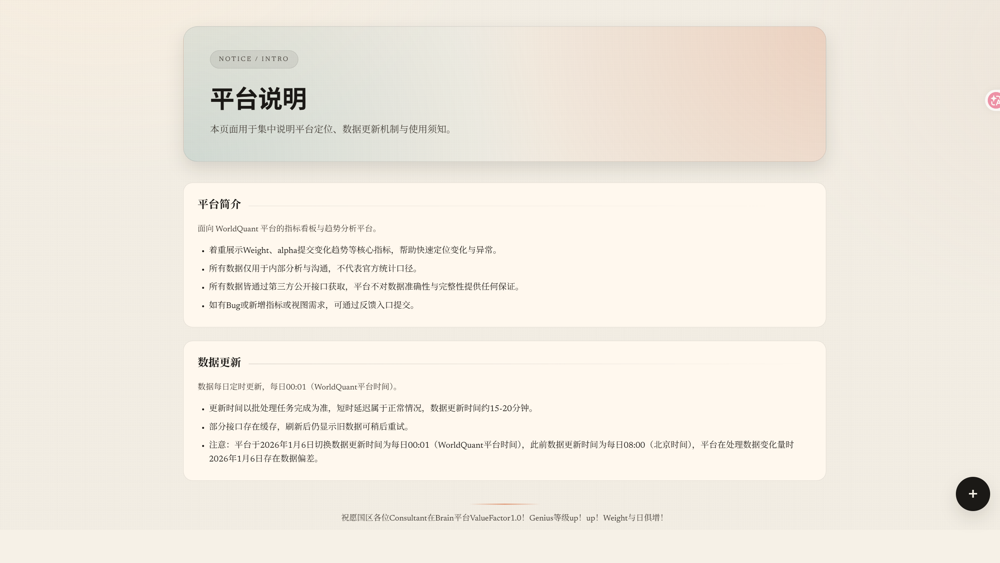

# WQ Manager Frontend

基于 Vue 3 + TypeScript 的前端项目，提供看板、趋势、个人中心、Genius 仪表盘等页面。

在线体验：https://wqmanager.qzz.io/

## 技术栈

- Vue 3 / TypeScript
- Vite
- Element Plus
- Axios

## 本地开发

```bash
npm install
npm run dev
```

默认端口：`http://localhost:5173`  
开发环境下，`/api` 会代理到 `http://localhost:8000`（见 `vite.config.ts`）。

## 构建

```bash
npm run build
```

产物位于 `dist/`。

## Docker 构建与启动

在 `frontend/` 目录执行：

```bash
docker build -t wq-frontend .
docker run -d --name wq-frontend -p 80:80 -p 443:443 \
  -v /opt/project/wq-manager/ssl:/etc/nginx/ssl:ro \
  wq-frontend
```

> 若无需 HTTPS，可去掉 `-p 443:443` 与证书挂载。

## 接口配置

Axios 默认配置位于 `src/api/client.ts`：
- `baseURL: /api/v1`
- `timeout: 30000`（30s）

生产环境下由 Nginx 代理 `/api/` 到后端服务。

## Nginx 部署

生产环境使用 `frontend/nginx.conf`：
- 静态资源根目录 `/usr/share/nginx/html`
- `/api/` 反向代理到后端容器
- 已支持 HTTPS（证书通过 volume 挂载）

如需修改域名或证书路径，请更新该文件并重建前端容器。

## 相关截图
- Login


- Home


- Genius


- Trend


- Profile


- Notice
